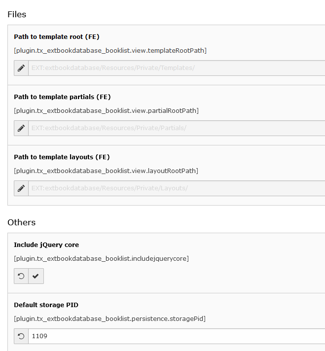

.. include:: ../Includes.txt

.. _configuration:

=============
Configuration
=============

The extension can be configured via the constant editor:

   You can set all needed values via the constant editor.

* Path to template root (FE), Path to template partials (FE), Path to template layouts (FE): Change path for the templates to adopt your own templates.
* Include jQuery core: yes/no <- if yes, jQuery core is included. jQuery is needed for datatables (sorting etc.).
* Default storage PID: PID of the folder where you store your books.