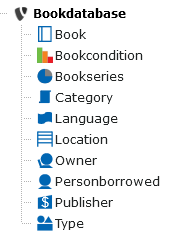
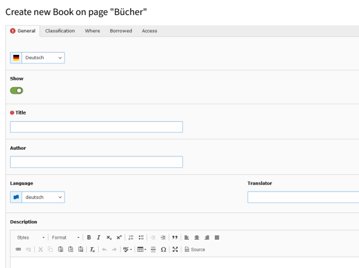
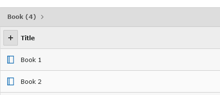

.. include:: ../Includes.txt

.. _for-editors:

===========
For Editors
===========

Before adding books, you should add some

* Book Conditions: Condition of the book, i.e. good, bad...
* Bookseries: when books belong to a series, you can define the series here
* Categories: Categorie of the book (i.e. politcs, nature, crime...)
* Languages: Language of the book (i.e. english, german...)
* Locations: Where is the book stored? (i.e. bookshelf 1...)
* Owners: Who own the book (i.e. you)
* Publishers: Publisher of the book (i.a. dtv, Knauer)
* Types: Type of book (i.e. softcover, hardcover)

if needed.
You do not need to fill all the stuff, user the ones that fit your needs.

To add books and stuff, switch to listview in your TYPO3-Backend and select the folder where the entries for books should be stored.
Add new record an choose:

Adding books works the same like descriped before. The only mandatory field is the title of the book.
Note the tabs! You can add a lot of informations to your books.

   Form to add books

When books (and the other stuff) is added, you can see the entries in the listview.

   Listview of books

.. tip::

   A unique signature is created for every book. Its build from owneritemshortcut-bookuid-locationshortcut, i.e. criwe-12345-shelf1.
   You can change the signature by modding Templates/Book/List.html and Templates/Book/Show.html. 
   The idea: put the signature in/on your book, so you know where to put your books and/or know where your books are stored.