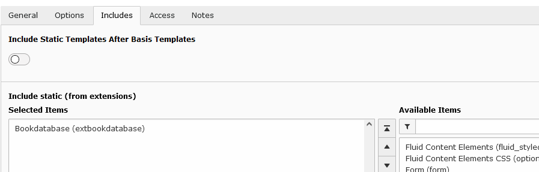

.. include:: ../Includes.txt

.. _installation:

============
Installation
============

* Import and install the extension
	- via the extension manager 
        - composer

* Create a sysfolder where the entries for the books are stored

* Add some books!

See :ref:`Editor <editor>`

* Add the static template (Use extension template or user your sitepackage)

 
* Do some configurations (Use extension template or user your sitepackage)

See :ref:`Configuration <configuration>`

* Insert the plugin to get an output

.. figure:: ../Images/Installation/insert_plugin.png
   :class: with-shadow
   :alt: insert plugin.
