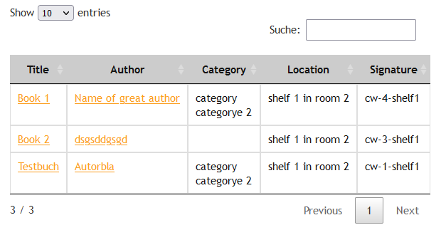
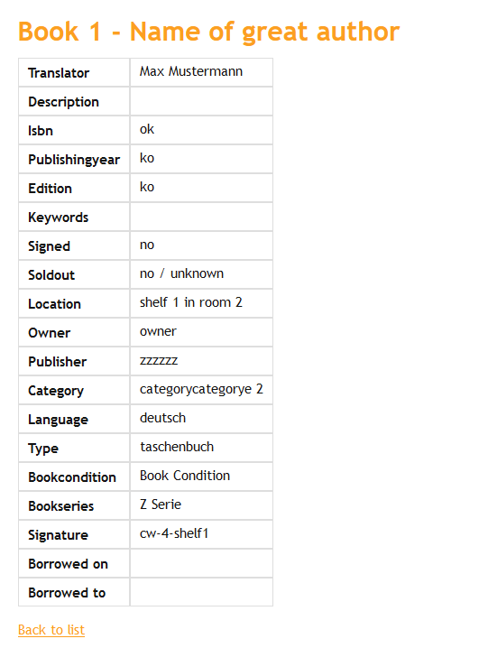

.. include:: ../Includes.txt

.. _introduction:

============
Introduction
============

What does it do?
================

A Simple TYPO3 Bookdatabase. You can manage your books, so you know where your books are stored.

See :ref:`Configuration <configuration>`

.. _screenshots:

Screenshots
===========

   Sample output of listview. You can filter your books by title, author, category...

 
The screenshots show how the frontend could look like.
